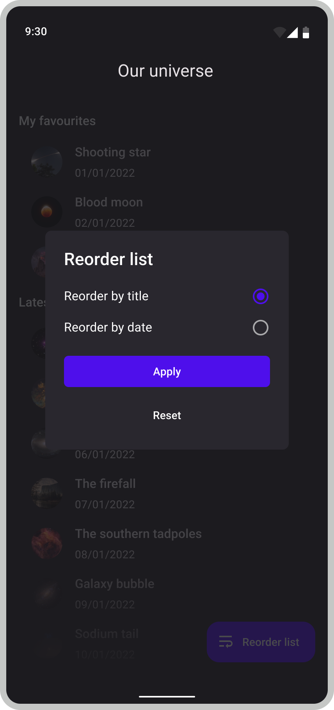

# Adyen Android Assignment

This repository contains the coding challenge for candidates applying for an Android role at Adyen.
Please keep your Git history intact as we are interested in your development process as well as the end result.
Feel free to make changes to any code in this repository.

The goal of this assignment is to build an app that utilizes the NASA Astronomy Picture of the Day (APOD).
We have set up some basic networking code; you still need to register for an [API key](https://api.nasa.gov/) 
and add it to `app/local.gradle` - see `local.gradle.example` for details. 
You can verify your API key works by running the `PlanetaryServiceTest`.

## Features

- [ ] Create a list screen of APODs :
  * Videos can be skipped.
- [ ] Allow reordering of APODs :
  * Order by title - ascending.
  * Order by date - descending.
- [ ] Error handling:
  * No network connection .
  * API error .
- [ ] (OPTIONAL) Show a details screen with more info about a single APOD .
- [ ] (OPTIONAL) Allow saving APODs, pinning them to the top of the list screen.

n.b The resources folder contains a few appropriate colors and icons if you wish to replicate the above screens. However, the above screens serve only as an example. You are free to implement the UI as you wish.

Tips for candidates to think about:

- [ ] App should function in both portrait and landscape orientations
- [ ] Unit tests

## Grading

We are interested in:
* How they are implemented - architecture, error handling, styling.
* How the features work - user functionality.
* And why implementation decisions were taken.
